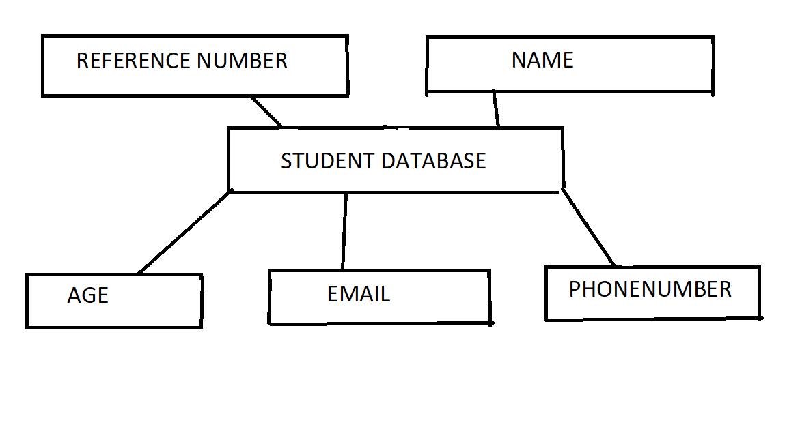
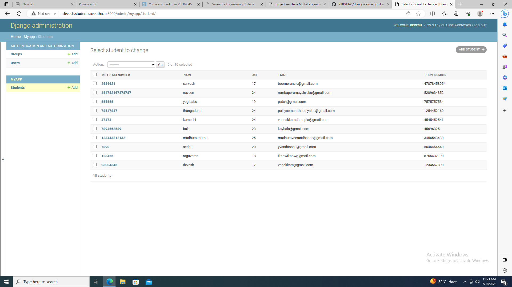
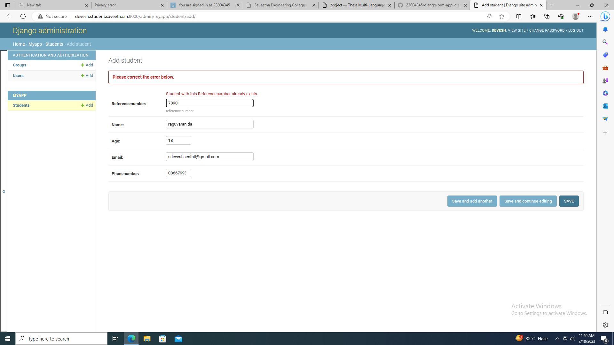

# Django ORM Web Application

## AIM
To develop a Django application to store and retrieve data from a database using Object Relational Mapping(ORM).

## Entity Relationship Diagram



## DESIGN STEPS

### STEP 1:
create the folder'ex02'under directory 'unit2'

### STEP 2:
clone the github respository into the directory "ex02" using the command "git clone"<ur1>

### STEP 3:
under the folder "django-orm-app" enter the directory titled "dataproject" and go to the "settings.py" under the file and "import in" line 34 set ALLOWED_HOST[*] and add myapp under the INSTALLED-APP

### STEP 4:
Now return to the parent folder "dataproject" and install the application myapp usingthe command "python3 manage.py startapp myapp"
 
### STEP 5:
Under the directory "myapp",open "models.py" and enter the code for column headings

### STEP 6:
Under the directory "myapp",open "admin.py" and enter the code to set up the admin

### STEP 7:
Now return to the parent folder "dataproject", and into the prompt, enter the command "python3 manage.py make integrations"

### STEP 8:
I   nto the prompt, type the command "python3 manage.py migrate"

### STEP 9:
Now create a superuser by typing the command "python3 manage.py createsuperuser" into the prompt. Enter the username, leave the email address blank and enter the password to create to it

### STEP 10:
Into the prompt, type the command "python3 manage.py runserver 0:8000" to run the server at port number 8000

###  STEP 11:
Now open the admin login page and enter the username and password to login.

### STEP 12:
Under the "MYAPP" section, click on "Add" next to the "Students" to create a record. Create 10 records in the same way.

### STEP 13:
Once the records are made, take a screenshot and save it.

### STEP 14:
Upload
Write your own steps

## PROGRAM
### models.py
```py
from django.db import models
from django.contrib import admin

# Create your models here.
class Student (models.Model):
    referencenumber=models.CharField(primary_key=True,max_length=20,help_text="reference number")
    name=models.CharField(max_length=100)
    age=models.IntegerField()
    email=models.EmailField()
    phonenumber=models.IntegerField()

class StudentAdmin(admin.ModelAdmin):
    list_display=('referencenumber','name','age','email','phonenumber')
```
### admin.py
```py
from django.contrib import admin
from .models import Student,StudentAdmin
# Register your models here.
admin.site.register(Student,StudentAdmin)
```

## OUTPUT

### student list




## RESULT
The program is completed successful.
